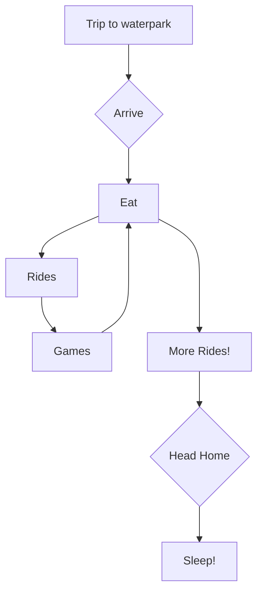

Trip to waterpark: The ride to destination    
Arrive: The first point of the day's itinerary  
Eat: First planned activity. Will be second occurrence  
Rides: Main planned activity  
Games: The change of pace activity  
More Rides: Final phase of plan at waterpark  
Head home: Final action of the total plan  
Sleep!: Completion of whole day plan